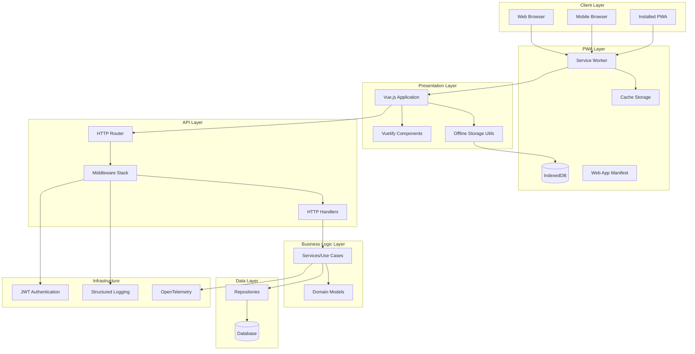
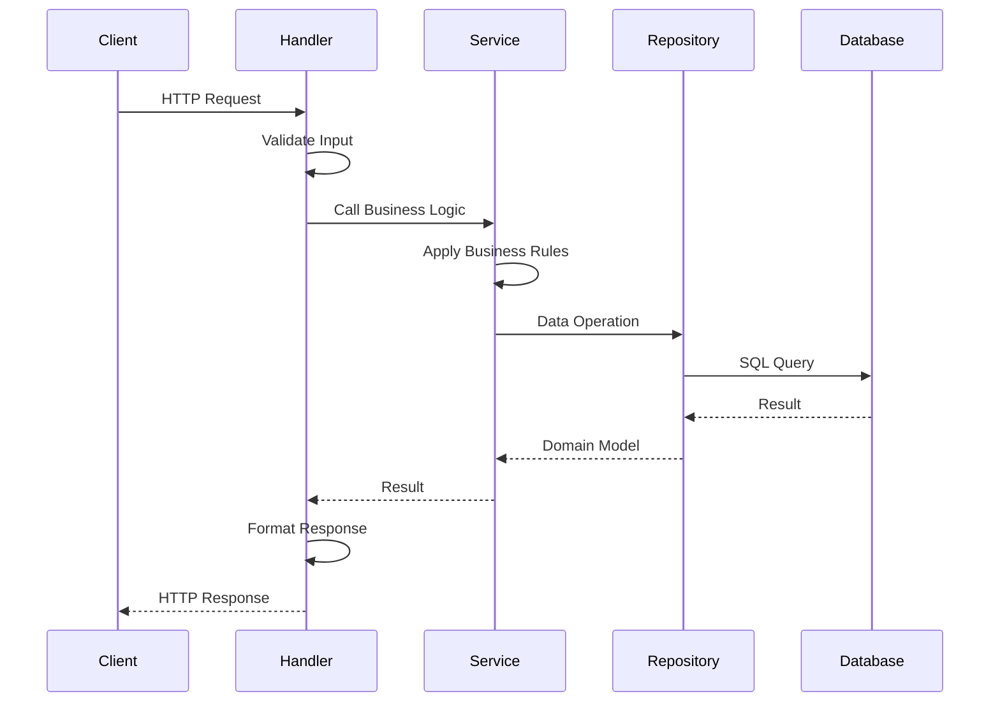
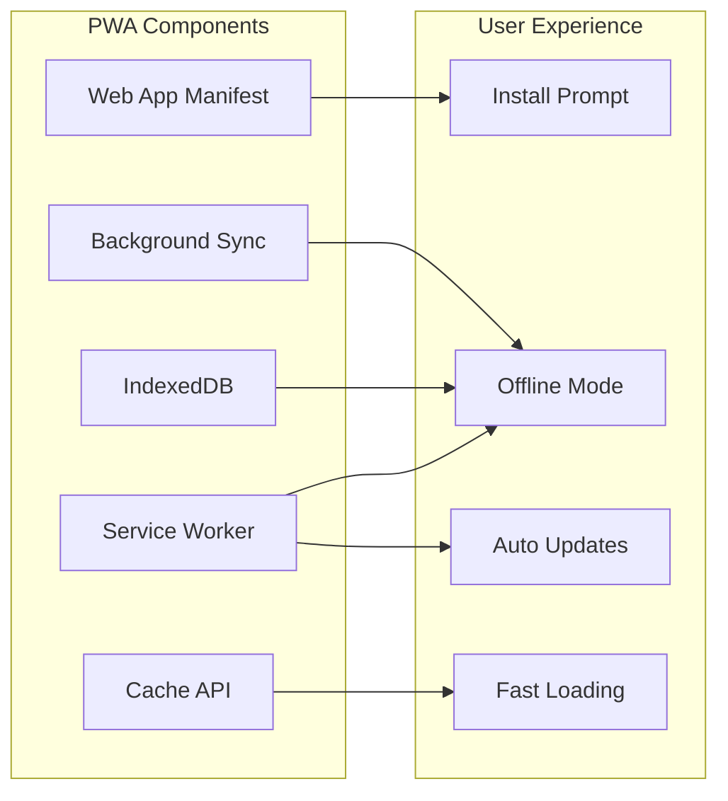
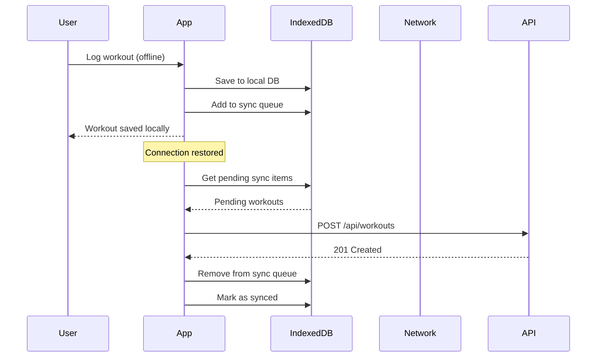
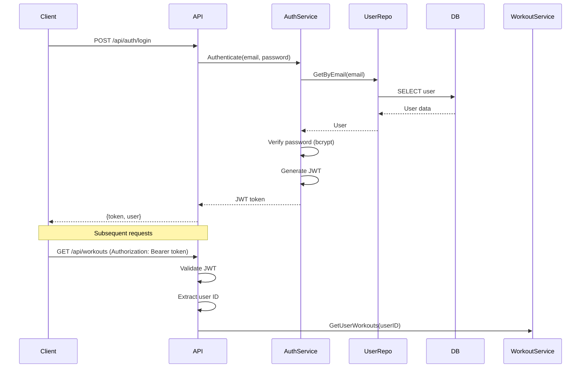
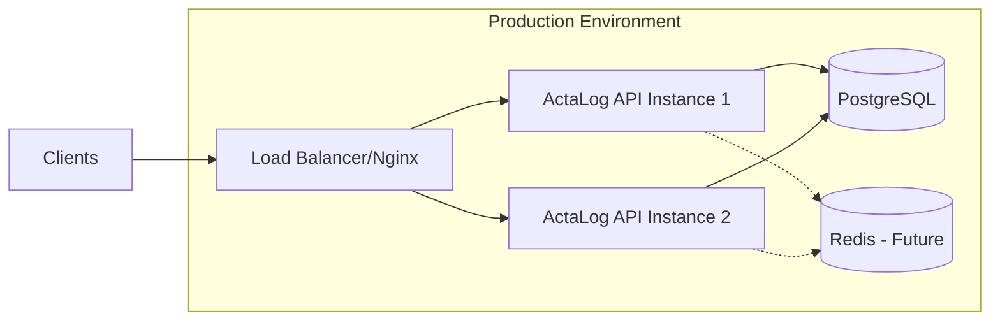

# Architecture Documentation

## Overview

ActaLog is a mobile-first **Progressive Web App (PWA)** built using Clean Architecture principles with a Go backend and Vue.js frontend. The system is designed to be modular, testable, scalable, and works offline-first with automatic synchronization.

## Architecture Pattern

We follow **Clean Architecture** (also known as Hexagonal Architecture or Ports and Adapters), which provides:

- **Independence from frameworks**: Business logic doesn't depend on external libraries
- **Testability**: Business rules can be tested without UI, database, or external dependencies
- **Independence from UI**: UI can change without affecting business logic
- **Independence from database**: Can swap databases without changing business rules
- **Independence from external services**: Business rules don't know about the outside world

## System Architecture



## Directory Structure

```
actalog/
├── cmd/
│   └── actalog/           # Application entry point
│       └── main.go
├── internal/              # Private application code
│   ├── domain/           # Business entities and interfaces
│   │   ├── user.go
│   │   ├── workout.go
│   │   └── movement.go
│   ├── repository/       # Data access implementations
│   │   ├── user_repo.go
│   │   ├── workout_repo.go
│   │   └── movement_repo.go
│   ├── service/          # Business logic/use cases
│   │   ├── user_service.go
│   │   ├── workout_service.go
│   │   └── movement_service.go
│   └── handler/          # HTTP handlers
│       ├── user_handler.go
│       ├── workout_handler.go
│       └── movement_handler.go
├── pkg/                   # Public, reusable packages
│   ├── auth/             # Authentication utilities
│   ├── middleware/       # HTTP middleware
│   ├── utils/            # Utility functions
│   └── version/          # Version information
├── api/                   # API definitions
│   ├── rest/             # REST API routes
│   └── models/           # API request/response models
├── configs/              # Configuration management
│   └── config.go
├── test/                 # Tests
│   ├── unit/            # Unit tests
│   └── integration/     # Integration tests
├── web/                  # Frontend application
│   ├── public/          # Static assets
│   └── src/             # Vue.js source code
├── docs/                # Documentation
├── design/              # Design assets
└── migrations/          # Database migrations
```

## Layer Responsibilities

### 1. Domain Layer (`internal/domain/`)

**Responsibility**: Contains business entities and repository interfaces

- Pure Go structs representing business concepts
- Repository interfaces (defined here, implemented elsewhere)
- No external dependencies
- The heart of the application

**Core Entities** (Showing planned v0.3.0 schema - not yet implemented):

```go
// User represents a system user
type User struct {
    ID            int64
    Email         string
    PasswordHash  string
    Name          string
    Birthday      *time.Time
    ProfileImage  string
    Role          string
    CreatedAt     time.Time
    UpdatedAt     time.Time
    UpdatedBy     *int64
    LastLoginAt   *time.Time
}

// WOD represents a predefined CrossFit workout
type WOD struct {
    ID          int64
    Name        string
    Source      string // CrossFit, Other Coach, Self-recorded
    Type        string // Benchmark, Hero, Girl, Notables, Games, Endurance, Self-created
    Regime      string // EMOM, AMRAP, Fastest Time, etc.
    ScoreType   string // Time, Rounds+Reps, Max Weight
    Description string
    URL         string
    Notes       string
    CreatedBy   *int64
    CreatedAt   time.Time
    UpdatedAt   time.Time
    UpdatedBy   *int64
}

// StrengthMovement represents an exercise/movement
type StrengthMovement struct {
    ID           int64
    Name         string
    MovementType string // weightlifting, cardio, gymnastics
    Description  string
    CreatedBy    *int64
    CreatedAt    time.Time
    UpdatedAt    time.Time
    UpdatedBy    *int64
}

// Workout represents a workout template (reusable)
type Workout struct {
    ID        int64
    Name      string
    Notes     string
    CreatedAt time.Time
    UpdatedAt time.Time
    UpdatedBy *int64
}

// UserWorkout links a user to a workout on a specific date
type UserWorkout struct {
    ID          int64
    UserID      int64
    WorkoutID   int64
    WorkoutDate time.Time
    Notes       string
    CreatedAt   time.Time
    UpdatedAt   time.Time
}

// WorkoutWOD links a workout to a WOD with scoring
type WorkoutWOD struct {
    ID         int64
    WorkoutID  int64
    WODID      int64
    ScoreValue string
    OrderIndex int
    CreatedAt  time.Time
    UpdatedAt  time.Time
}

// WorkoutStrength links a workout to a strength movement with details
type WorkoutStrength struct {
    ID         int64
    WorkoutID  int64
    StrengthID int64
    Weight     *float64
    Sets       *int
    Reps       *int
    Notes      string
    OrderIndex int
    CreatedAt  time.Time
    UpdatedAt  time.Time
}

// UserSetting stores user preferences
type UserSetting struct {
    ID                      int64
    UserID                  int64
    NotificationPreferences string
    DataExportFormat        string
    Theme                   string
    CreatedAt               time.Time
    UpdatedAt               time.Time
}

// AuditLog records significant actions
type AuditLog struct {
    ID        int64
    UserID    *int64
    Action    string
    Details   string
    Timestamp time.Time
}

// Repository Interfaces
type UserRepository interface {
    Create(user *User) error
    GetByID(id int64) (*User, error)
    GetByEmail(email string) (*User, error)
    Update(user *User) error
}

type WODRepository interface {
    Create(wod *WOD) error
    GetByID(id int64) (*WOD, error)
    GetByName(name string) (*WOD, error)
    List(filters map[string]interface{}) ([]*WOD, error)
    Update(wod *WOD) error
}

type StrengthMovementRepository interface {
    Create(movement *StrengthMovement) error
    GetByID(id int64) (*StrengthMovement, error)
    ListByType(movementType string) ([]*StrengthMovement, error)
}

type UserWorkoutRepository interface {
    Create(userWorkout *UserWorkout) error
    GetByUserAndDate(userID int64, date time.Time) ([]*UserWorkout, error)
    GetByDateRange(userID int64, start, end time.Time) ([]*UserWorkout, error)
}

// ... and more repository interfaces
```

### 2. Repository Layer (`internal/repository/`)

**Responsibility**: Implements data access interfaces defined in domain

- Implements repository interfaces from domain layer
- Handles database queries and data mapping
- Isolates persistence logic
- Can be easily swapped (e.g., SQLite to PostgreSQL)

### 3. Service Layer (`internal/service/`)

**Responsibility**: Contains business logic and use cases

- Orchestrates business workflows
- Uses repositories for data access
- Validates business rules
- Transaction management
- Independent of delivery mechanism (HTTP, gRPC, etc.)

### 4. Handler Layer (`internal/handler/`)

**Responsibility**: HTTP request/response handling

- Receives HTTP requests
- Validates input
- Calls service layer
- Formats responses
- Error handling and status codes

### 5. API Layer (`api/`)

**Responsibility**: API contracts and routing

- REST endpoint definitions
- Request/response models (DTOs)
- API versioning
- Route configuration

## Data Flow



## Dependency Rule

Dependencies can only point inward:

```
Handlers → Services → Domain ← Repositories
```

- **Domain** has no dependencies
- **Services** depend only on Domain
- **Repositories** depend only on Domain
- **Handlers** depend on Services and Domain

## Key Design Patterns

### 1. Dependency Injection

All dependencies are injected through constructors:

```go
type UserService struct {
    userRepo domain.UserRepository
}

func NewUserService(repo domain.UserRepository) *UserService {
    return &UserService{userRepo: repo}
}
```

### 2. Repository Pattern

Data access is abstracted through interfaces:

```go
// Domain defines the interface
type UserRepository interface {
    GetByID(id int64) (*User, error)
}

// Repository implements it
type PostgresUserRepository struct { ... }
func (r *PostgresUserRepository) GetByID(id int64) (*User, error) { ... }
```

### 3. Interface Segregation

Small, focused interfaces instead of large ones:

```go
type UserReader interface {
    GetByID(id int64) (*User, error)
}

type UserWriter interface {
    Create(user *User) error
}
```

## Technology Stack

### Backend
- **Language**: Go 1.21+
- **Web Framework**: Standard library `net/http` + gorilla/mux or chi
- **Database**: SQLite (dev), PostgreSQL (prod)
- **ORM/Query Builder**: sqlx or raw SQL
- **Authentication**: JWT with golang-jwt
- **Password Hashing**: bcrypt
- **Observability**: OpenTelemetry
- **Testing**: Go standard testing + testify

### Frontend (PWA)
- **Framework**: Vue.js 3
- **UI Library**: Vuetify 3
- **State Management**: Pinia
- **HTTP Client**: Axios
- **Build Tool**: Vite 6
- **PWA Plugin**: vite-plugin-pwa
- **Service Worker**: Workbox 7
- **Offline Storage**: IndexedDB (native browser API)
- **Testing**: Vitest + Vue Test Utils

### Infrastructure
- **Containerization**: Docker + Docker Compose
- **Database**: MariaDB/PostgreSQL/SQLite
- **Web Server**: Nginx (optional reverse proxy)
- **Migrations**: golang-migrate
- **HTTPS**: Required for PWA (Let's Encrypt)

## PWA Architecture

ActaLog is built as a Progressive Web App, providing native app-like experience with offline capabilities.

### PWA Core Components



### 1. Web App Manifest

**Location**: Auto-generated by vite-plugin-pwa

**Configuration** (in `vite.config.js`):
```javascript
manifest: {
  name: 'ActaLog - CrossFit Workout Tracker',
  short_name: 'ActaLog',
  description: 'Track your CrossFit workouts...',
  theme_color: '#2c3657',
  background_color: '#ffffff',
  display: 'standalone',
  icons: [...]
}
```

**Capabilities**:
- Installable to home screen on iOS, Android, and desktop
- Custom splash screen with theme colors
- Standalone display mode (no browser UI)
- Portrait orientation for mobile

### 2. Service Worker (Workbox)

**Auto-generated by vite-plugin-pwa with Workbox strategies**

**Caching Strategies**:

1. **CacheFirst** (Static Assets)
   - Fonts (Google Fonts, Material Design Icons)
   - CSS, JS bundles
   - Images and icons
   - Used for rarely-changing resources

2. **NetworkFirst** (API Data)
   - API responses with 5-minute cache fallback
   - 10-second network timeout
   - Falls back to cache if offline

3. **Precaching**
   - All build assets automatically precached
   - Updated on new deployment

### 3. Offline Storage (IndexedDB)

**Implementation**: `src/utils/offlineStorage.js`

**Object Stores**:
- `workouts` - Cached workout data
- `movements` - Cached movement library
- `pendingSync` - Queue for offline operations

**Workflow**:


**Key Functions**:
- `saveWorkoutOffline()` - Save workout when offline
- `getWorkoutsOffline()` - Retrieve cached workouts
- `syncWithServer()` - Sync pending operations
- `markWorkoutSynced()` - Update sync status

### 4. Offline-First Strategy

**Data Flow**:
1. **Always try network first** for fresh data
2. **Cache successful responses** for offline access
3. **Use cached data** when offline
4. **Queue write operations** for background sync
5. **Sync automatically** when connection restored

**Network Detection**:
```javascript
// Listen for online/offline events
window.addEventListener('online', syncWithServer)
window.addEventListener('offline', showOfflineNotice)

// Check current status
if (navigator.onLine) {
  // Online - normal operation
} else {
  // Offline - use cache
}
```

### 5. Update Strategy

**Auto-update with user notification**:
- Service worker checks for updates on page load
- New version silently downloaded in background
- User prompted to reload when critical updates available
- Seamless updates without app store delays

**Update Flow**:
```javascript
registerSW({
  onNeedRefresh() {
    // Notify user of update
    if (confirm('New version available. Reload?')) {
      updateSW(true)
    }
  }
})
```

### PWA Checklist

✅ Web App Manifest with complete metadata
✅ Service Worker for offline functionality
✅ HTTPS in production (required for PWA)
✅ Responsive design (mobile-first)
✅ Fast loading with cache strategies
✅ Offline page/graceful degradation
✅ Add to home screen capability
✅ App icons (72px - 512px)
✅ Background sync for offline operations
⏳ Push notifications (future enhancement)

### Performance Optimizations

1. **Code Splitting**: Lazy-load routes and components
2. **Asset Optimization**: Compress images, minify CSS/JS
3. **Precaching**: Critical resources cached on install
4. **Runtime Caching**: API responses cached intelligently
5. **IndexedDB**: Efficient local data storage

### Browser Support

- **Chrome/Edge**: Full support (Desktop & Mobile)
- **Safari**: Full support iOS 11.3+ (with limitations on install prompt)
- **Firefox**: Full support (Desktop & Android)
- **Samsung Internet**: Full support
- **Opera**: Full support

**Graceful Degradation**:
- Works as regular web app in older browsers
- Progressive enhancement for modern browsers
- No broken functionality in non-PWA browsers

## Security Architecture

### Authentication Flow



### Security Measures

1. **Password Security**: Bcrypt with cost factor 12+
2. **SQL Injection Prevention**: Parameterized queries only
3. **XSS Prevention**: Input sanitization and output encoding
4. **CSRF Protection**: CSRF tokens for state-changing operations
5. **Rate Limiting**: Token bucket algorithm
6. **TLS/SSL**: Required in production
7. **CORS**: Configurable allowed origins
8. **Input Validation**: Strict validation at all entry points

## Observability

### Three Pillars

1. **Logs**: Structured JSON logging with correlation IDs
2. **Metrics**: Request latency, throughput, error rates
3. **Traces**: Distributed tracing with OpenTelemetry

### Key Metrics

- Request duration (p50, p95, p99)
- Request rate (requests/second)
- Error rate (errors/second)
- Database query duration
- Active connections
- Memory usage

## Testing Strategy

### Test Pyramid

```
       /\
      /  \  E2E Tests (Few)
     /____\
    /      \ Integration Tests (Some)
   /________\
  /          \ Unit Tests (Many)
 /____________\
```

### Test Types

1. **Unit Tests** (`test/unit/`): Test individual functions/methods
2. **Integration Tests** (`test/integration/`): Test component interactions
3. **E2E Tests**: Test complete user workflows

### Test Practices

- Table-driven tests for multiple scenarios
- Mocking external dependencies
- Test coverage > 80%
- Parallel test execution where safe
- Test isolation (no shared state)

## Deployment Architecture



## Performance Considerations

1. **Database Indexing**: Proper indexes on frequently queried columns
2. **Connection Pooling**: Reuse database connections
3. **Caching Strategy**:
   - Service Worker cache for static assets
   - IndexedDB for offline data
   - Redis for session data (future)
4. **Pagination**: Limit result sets with offset/limit
5. **Lazy Loading**: Load related data on demand
6. **Compression**: gzip compression for API responses
7. **PWA Precaching**: Critical resources cached on app install
8. **Code Splitting**: Lazy-load routes and components

## Future Enhancements

1. **Push Notifications**: Web Push API for workout reminders and achievements
2. **gRPC API**: For enhanced performance on mobile devices
3. **GraphQL**: Flexible querying for complex data requirements
4. **Event Sourcing**: Audit trail and temporal queries
5. **Microservices**: Split into smaller services as needed
6. **Real-time Updates**: WebSockets for live workout tracking
7. **Advanced PWA Features**:
   - Periodic background sync for data refresh
   - Web Share API for workout sharing
   - File System Access API for bulk data operations
   - Badging API for unsynced workout notifications

## Version History

- **v0.3.0**: Planned database schema redesign (documented but not yet implemented)
- **v0.2.0-beta**: Multi-database support, workout logging backend (current version)
- **v0.1.0**: Initial schema and architecture implementation (current schema)

## Notes on Planned v0.3.0 Schema

**Status:** Documented design, not yet implemented in codebase.

The database schema redesign is documented to better represent the logical data model:

**Key Architectural Changes:**
1. **Workouts as Templates**: Workouts are now reusable templates rather than user-specific instances
2. **WOD Entity**: New first-class entity for CrossFit WODs with comprehensive metadata
3. **Junction Tables**: Proper many-to-many relationships via junction tables (user_workouts, workout_wods, workout_strength)
4. **Audit Trail**: Built-in audit logging for accountability and troubleshooting
5. **User Settings**: Separate table for user preferences

**Impact on Application Layers:**
- **Domain Layer**: New entities (WOD, StrengthMovement, UserWorkout, etc.) require new repository interfaces
- **Service Layer**: Business logic must handle template-based workouts and user instances separately
- **API Layer**: Endpoints need refactoring to support new workflow (create template → log user workout)
- **Frontend**: UI must distinguish between workout templates and user workout logs

**Migration Strategy (When Implemented):**
- Database migrations will transform existing data from v0.1.0 schema to v0.3.0
- Existing user workouts will be converted to the new template + user_workout structure
- Standard WODs and movements will be seeded during migration
