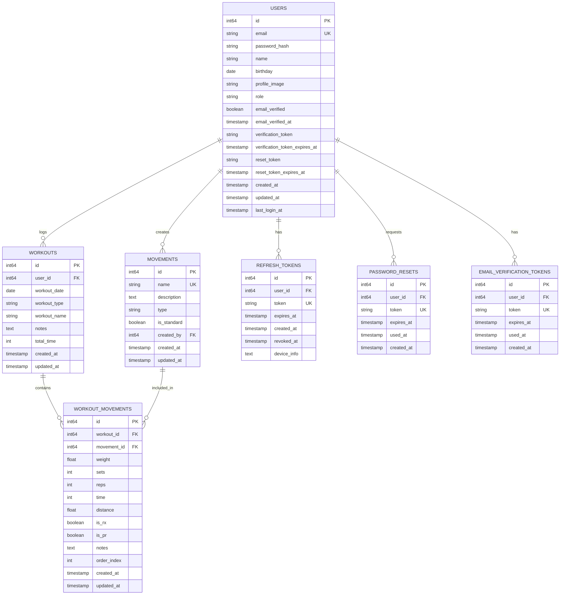

# Database Schema

ActaLog uses a relational database to store user data, workouts, movements, and workout history.

## Supported Databases

- SQLite (default for development)
- PostgreSQL (recommended for production)
- MariaDB/MySQL (supported)

## Schema Version

**Current Version:** 0.3.3-beta

## Entity Relationship Diagram

## Logical Data Model

The ActaLog data model follows a straightforward structure:

**Workout Instance = User-specific workout logged on a date**

### Key Principles

1. **Workouts** are user-specific instances logged on specific dates
2. **Movements** are exercise definitions (weightlifting, cardio, gymnastics)
3. **Workout Movements** link workouts to movements with performance data (weight, sets, reps, etc.)
4. Users can create custom movements in addition to standard pre-seeded movements
5. Personal Records (PRs) are tracked per movement for each user

## Table Definitions

### users

Stores user account information, authentication credentials, and profile data.

| Column | Type | Constraints | Description |
|--------|------|-------------|-------------|
| id | BIGINT | PRIMARY KEY, AUTO_INCREMENT | Unique user identifier |
| email | VARCHAR(255) | UNIQUE, NOT NULL | User email (login identifier) |
| password_hash | VARCHAR(255) | NOT NULL | Bcrypt hashed password (cost ≥12) |
| name | VARCHAR(255) | NOT NULL | User display name |
| birthday | DATE | NULL | User's birth date (added v0.3.3) |
| profile_image | TEXT | NULL | URL to profile picture |
| role | VARCHAR(50) | NOT NULL, DEFAULT 'user' | User role (user, admin) |
| email_verified | BOOLEAN | NOT NULL, DEFAULT FALSE | Email verification status (added v0.3.1) |
| email_verified_at | TIMESTAMP | NULL | When email was verified (added v0.3.1) |
| verification_token | VARCHAR(255) | NULL | Email verification token (added v0.3.1) |
| verification_token_expires_at | TIMESTAMP | NULL | Verification token expiration (added v0.3.1) |
| reset_token | VARCHAR(255) | NULL | Password reset token (added v0.2.0) |
| reset_token_expires_at | TIMESTAMP | NULL | Reset token expiration (added v0.2.0) |
| created_at | TIMESTAMP | NOT NULL, DEFAULT CURRENT_TIMESTAMP | Account creation time |
| updated_at | TIMESTAMP | NOT NULL, DEFAULT CURRENT_TIMESTAMP | Last update time |
| last_login_at | TIMESTAMP | NULL | Last successful login |

**Indexes:**
- PRIMARY KEY (id)
- UNIQUE INDEX idx_users_email (email)
- INDEX idx_users_role (role)

**Security Notes:**
- Passwords hashed with bcrypt (cost factor 12)
- First registered user automatically receives admin role
- JWT tokens used for authentication (stored client-side only)

### workouts

Stores user-specific workout instances logged on specific dates.

| Column | Type | Constraints | Description |
|--------|------|-------------|-------------|
| id | BIGINT | PRIMARY KEY, AUTO_INCREMENT | Unique workout identifier |
| user_id | BIGINT | NOT NULL, FOREIGN KEY | Reference to users.id |
| workout_date | DATE | NOT NULL | Date workout was performed |
| workout_type | VARCHAR(50) | NOT NULL | Type: strength, metcon, cardio, mixed |
| workout_name | VARCHAR(255) | NULL | Optional workout name/title |
| notes | TEXT | NULL | User's notes for this workout |
| total_time | INT | NULL | Total workout duration (seconds) |
| created_at | TIMESTAMP | NOT NULL, DEFAULT CURRENT_TIMESTAMP | Record creation time |
| updated_at | TIMESTAMP | NOT NULL, DEFAULT CURRENT_TIMESTAMP | Last update time |

**Indexes:**
- PRIMARY KEY (id)
- INDEX idx_workouts_user_id (user_id)
- INDEX idx_workouts_workout_date (workout_date)
- INDEX idx_workouts_user_date (user_id, workout_date DESC)

**Foreign Keys:**
- FOREIGN KEY (user_id) REFERENCES users(id) ON DELETE CASCADE

**Design Note:**
- Each workout is a unique instance owned by a user
- Users can log multiple workouts per day
- Workouts are not templates - they represent actual performed workouts

### movements

Stores movement/exercise definitions (both standard and user-created).

| Column | Type | Constraints | Description |
|--------|------|-------------|-------------|
| id | BIGINT | PRIMARY KEY, AUTO_INCREMENT | Unique movement identifier |
| name | VARCHAR(255) | UNIQUE, NOT NULL | Movement name (e.g., "Back Squat") |
| description | TEXT | NULL | Movement description/instructions |
| type | VARCHAR(50) | NOT NULL | Type: weightlifting, cardio, gymnastics, bodyweight |
| is_standard | BOOLEAN | NOT NULL, DEFAULT FALSE | TRUE for pre-seeded movements, FALSE for user-created |
| created_by | BIGINT | NULL, FOREIGN KEY | User ID if custom movement (NULL for standard) |
| created_at | TIMESTAMP | NOT NULL, DEFAULT CURRENT_TIMESTAMP | Record creation time |
| updated_at | TIMESTAMP | NOT NULL, DEFAULT CURRENT_TIMESTAMP | Last update time |

**Indexes:**
- PRIMARY KEY (id)
- UNIQUE INDEX idx_movements_name (name)
- INDEX idx_movements_type (type)
- INDEX idx_movements_standard (is_standard)

**Foreign Keys:**
- FOREIGN KEY (created_by) REFERENCES users(id) ON DELETE SET NULL

**Standard Movements:**
The application pre-seeds 31 standard CrossFit movements on first run (see Standard Movements section below).

### workout_movements

Junction table linking workouts to movements with performance details.

| Column | Type | Constraints | Description |
|--------|------|-------------|-------------|
| id | BIGINT | PRIMARY KEY, AUTO_INCREMENT | Unique record identifier |
| workout_id | BIGINT | NOT NULL, FOREIGN KEY | Reference to workouts.id |
| movement_id | BIGINT | NOT NULL, FOREIGN KEY | Reference to movements.id |
| weight | DECIMAL(10,2) | NULL | Weight used (lbs or kg) |
| sets | INT | NULL | Number of sets |
| reps | INT | NULL | Reps per set or total reps |
| time | INT | NULL | Time for movement (seconds) |
| distance | DECIMAL(10,2) | NULL | Distance (meters, miles, etc.) |
| is_rx | BOOLEAN | NOT NULL, DEFAULT FALSE | TRUE if performed as prescribed |
| is_pr | BOOLEAN | NOT NULL, DEFAULT FALSE | Personal record flag (added v0.3.0) |
| notes | TEXT | NULL | Movement-specific notes |
| order_index | INT | NOT NULL, DEFAULT 0 | Order in workout sequence |
| created_at | TIMESTAMP | NOT NULL, DEFAULT CURRENT_TIMESTAMP | Record creation time |
| updated_at | TIMESTAMP | NOT NULL, DEFAULT CURRENT_TIMESTAMP | Last update time |

**Indexes:**
- PRIMARY KEY (id)
- INDEX idx_wm_workout_id (workout_id)
- INDEX idx_wm_movement_id (movement_id)
- INDEX idx_wm_workout_order (workout_id, order_index)

**Foreign Keys:**
- FOREIGN KEY (workout_id) REFERENCES workouts(id) ON DELETE CASCADE
- FOREIGN KEY (movement_id) REFERENCES movements(id) ON DELETE RESTRICT

**PR Auto-Detection:**
When a workout is created, the system automatically compares weight for each movement against the user's historical max and sets `is_pr=TRUE` if it's a new personal record. Users can also manually toggle the PR flag.

### refresh_tokens

Stores refresh tokens for "Remember Me" functionality (added v0.3.2).

| Column | Type | Constraints | Description |
|--------|------|-------------|-------------|
| id | BIGINT | PRIMARY KEY, AUTO_INCREMENT | Unique token identifier |
| user_id | BIGINT | NOT NULL, FOREIGN KEY | Reference to users.id |
| token | VARCHAR(255) | UNIQUE, NOT NULL | Cryptographically secure token |
| expires_at | TIMESTAMP | NOT NULL | Token expiration time |
| created_at | TIMESTAMP | NOT NULL | Token creation time |
| revoked_at | TIMESTAMP | NULL | When token was revoked (logout) |
| device_info | TEXT | NULL | Device/browser information |

**Indexes:**
- PRIMARY KEY (id)
- UNIQUE INDEX idx_refresh_tokens_token (token)
- INDEX idx_refresh_tokens_user_id (user_id)
- INDEX idx_refresh_tokens_expires (expires_at)

**Foreign Keys:**
- FOREIGN KEY (user_id) REFERENCES users(id) ON DELETE CASCADE

**Security Notes:**
- Tokens are 32-byte cryptographically secure random strings
- Tokens expire after 30 days
- Users can have multiple active tokens (different devices)
- Tokens are revoked on logout

### password_resets

Stores password reset tokens (separate repository implementation).

| Column | Type | Constraints | Description |
|--------|------|-------------|-------------|
| id | BIGINT | PRIMARY KEY, AUTO_INCREMENT | Unique reset identifier |
| user_id | BIGINT | NOT NULL, FOREIGN KEY | Reference to users.id |
| token | VARCHAR(255) | UNIQUE, NOT NULL | Password reset token |
| expires_at | TIMESTAMP | NOT NULL | Token expiration (1 hour) |
| used_at | TIMESTAMP | NULL | When token was used |
| created_at | TIMESTAMP | NOT NULL | Token creation time |

**Indexes:**
- PRIMARY KEY (id)
- UNIQUE INDEX idx_password_resets_token (token)
- INDEX idx_password_resets_user_id (user_id)

**Foreign Keys:**
- FOREIGN KEY (user_id) REFERENCES users(id) ON DELETE CASCADE

**Security:**
- Tokens are single-use only
- Tokens expire after 1 hour
- Email delivery via SMTP (configurable)

### email_verification_tokens

Stores email verification tokens (separate repository implementation).

| Column | Type | Constraints | Description |
|--------|------|-------------|-------------|
| id | BIGINT | PRIMARY KEY, AUTO_INCREMENT | Unique verification identifier |
| user_id | BIGINT | NOT NULL, FOREIGN KEY | Reference to users.id |
| token | VARCHAR(255) | UNIQUE, NOT NULL | Email verification token |
| expires_at | TIMESTAMP | NOT NULL | Token expiration (24 hours) |
| used_at | TIMESTAMP | NULL | When token was used |
| created_at | TIMESTAMP | NOT NULL | Token creation time |

**Indexes:**
- PRIMARY KEY (id)
- UNIQUE INDEX idx_email_verification_tokens_token (token)
- INDEX idx_email_verification_tokens_user_id (user_id)

**Foreign Keys:**
- FOREIGN KEY (user_id) REFERENCES users(id) ON DELETE CASCADE

**Behavior:**
- Sent automatically on user registration
- Sent on email address change
- Tokens expire after 24 hours
- Single-use tokens

## Standard Movements

The application pre-seeds 31 standard CrossFit movements on initialization:

### Weightlifting (11 movements)
- Back Squat
- Front Squat
- Overhead Squat
- Deadlift
- Sumo Deadlift
- Clean
- Power Clean
- Snatch
- Power Snatch
- Clean and Jerk
- Thruster

### Gymnastics (8 movements)
- Pull-up
- Chest-to-Bar Pull-up
- Bar Muscle-up
- Ring Muscle-up
- Handstand Push-up
- Strict Handstand Push-up
- Toes-to-Bar
- Knees-to-Elbow

### Bodyweight (6 movements)
- Push-up
- Sit-up
- Air Squat
- Burpee
- Box Jump
- Wall Ball

### Cardio (6 movements)
- Rowing
- Running
- Assault Bike
- Ski Erg
- Jump Rope
- Swimming

**Note:** Users can also create custom movements via the movements API.

## Migration History

Database migrations are managed through `internal/repository/migrations.go` and tracked in the `schema_migrations` table.

### v0.1.0 - Initial Schema
**Description:** Base schema with users, workouts, movements, workout_movements tables

**Tables Created:**
- users (basic auth fields)
- workouts (user-specific instances)
- movements (exercise definitions)
- workout_movements (junction table)

### v0.2.0 - Password Reset
**Description:** Add password reset token fields to users table

**Changes:**
- Added `reset_token` (VARCHAR/TEXT)
- Added `reset_token_expires_at` (TIMESTAMP)

**Features Enabled:** Password reset via email

### v0.3.0 - Personal Records
**Description:** Add PR tracking to workout_movements

**Changes:**
- Added `is_pr` (BOOLEAN) to workout_movements table

**Features Enabled:**
- Automatic PR detection on workout creation
- Manual PR flag toggling
- PR history views

### v0.3.1 - Email Verification
**Description:** Add email verification fields to users table

**Changes:**
- Added `email_verified` (BOOLEAN, DEFAULT FALSE)
- Added `email_verified_at` (TIMESTAMP)
- Added `verification_token` (VARCHAR/TEXT)
- Added `verification_token_expires_at` (TIMESTAMP)

**Features Enabled:**
- Email verification on registration
- Re-verification on email change
- Verification status tracking

### v0.3.2 - Remember Me
**Description:** Add refresh_tokens table for persistent sessions

**Changes:**
- Created `refresh_tokens` table with:
  - id, user_id, token, expires_at, created_at, revoked_at, device_info

**Features Enabled:**
- Remember Me checkbox on login
- 30-day persistent sessions
- Multi-device session management
- Token revocation on logout

### v0.3.3 - User Profiles
**Description:** Add birthday field to users table for profile editing

**Changes:**
- Added `birthday` (DATE) to users table

**Features Enabled:**
- User profile editing (name, email, birthday)
- Profile information display

## API Endpoints

### Authentication
- `POST /api/auth/register` - User registration
- `POST /api/auth/login` - User login (with optional Remember Me)
- `POST /api/auth/logout` - User logout (revokes refresh token)
- `POST /api/auth/refresh` - Refresh JWT using refresh token
- `POST /api/auth/forgot-password` - Request password reset
- `POST /api/auth/reset-password` - Reset password with token
- `GET /api/auth/verify-email?token=...` - Verify email address
- `POST /api/auth/resend-verification` - Resend verification email

### Users
- `GET /api/users/profile` - Get current user profile
- `PUT /api/users/profile` - Update user profile (name, email, birthday)

### Movements
- `GET /api/movements` - List all movements
- `GET /api/movements/search?q=...` - Search movements by name
- `POST /api/movements` - Create custom movement (authenticated)

### Workouts
- `POST /api/workouts` - Create new workout
- `GET /api/workouts` - List user's workouts
- `GET /api/workouts/{id}` - Get single workout
- `PUT /api/workouts/{id}` - Update workout
- `DELETE /api/workouts/{id}` - Delete workout
- `GET /api/workouts/prs` - Get personal records (aggregated by movement)
- `GET /api/workouts/pr-movements?limit=5` - Get recent PR-flagged movements
- `POST /api/workouts/movements/{id}/toggle-pr` - Toggle PR flag

## Security Considerations

1. **Password Storage:** Bcrypt hashing with cost factor ≥12
2. **SQL Injection:** All queries use parameterized statements (sqlx)
3. **Authentication:** JWT tokens with configurable expiration
4. **Refresh Tokens:** Secure random generation, single-use on revocation
5. **Email Tokens:** 32-byte cryptographically secure tokens
6. **Authorization:** Users can only access their own workouts and data
7. **CORS:** Configurable allowed origins via environment variable
8. **Cascading Deletes:** User data properly deleted on account deletion

## Performance Optimization

1. **Indexes:** Proper indexes on foreign keys and query patterns
2. **Composite Indexes:** Multi-column indexes for user_id + workout_date queries
3. **Eager Loading:** Movement details loaded with workouts to avoid N+1 queries
4. **Connection Pooling:** Database connection pool managed by database/sql
5. **Prepared Statements:** Reusable prepared statements for common queries

## Backup and Recovery

1. **SQLite Development:** Database file (`actalog.db`) can be backed up directly
2. **PostgreSQL Production:** Use pg_dump for regular backups
3. **Migration Tracking:** schema_migrations table preserves migration history
4. **Data Export:** Users can export their workout data (planned feature)

## Future Enhancements

Potential future schema additions (not yet implemented):

- **workout_templates** table for pre-defined benchmark WODs (Fran, Murph, etc.)
- **user_settings** table for preferences (theme, units, notifications)
- **social features** (followers, activity feed, leaderboards)
- **audit_logs** table for security and compliance tracking
- **workout_comments** for notes and reflections over time

## Version History

- **v0.3.3-beta** (Current): User profile editing with birthday field
- **v0.3.2-beta**: Remember Me functionality with refresh tokens
- **v0.3.1-beta**: Email verification system
- **v0.3.0-beta**: Personal Records (PR) tracking
- **v0.2.0-beta**: Password reset functionality
- **v0.1.0**: Initial schema design
