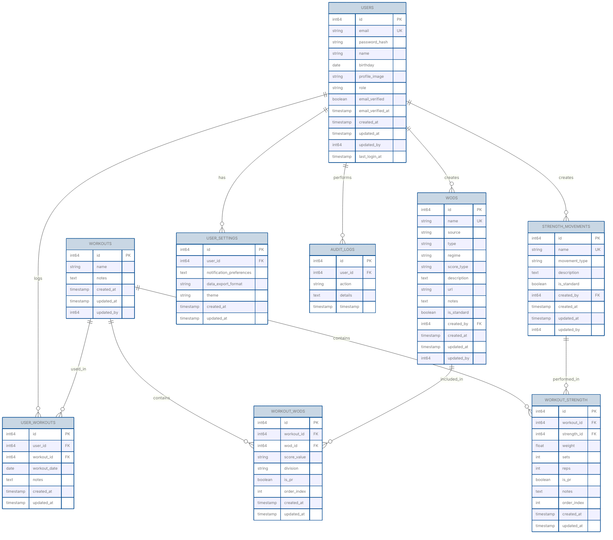

# Database Schema

ActaLog uses a relational database to store user data, workouts, WODs, strength movements, and workout history.

## Supported Databases

- SQLite (default for development)
- PostgreSQL (recommended for production)
- MariaDB/MySQL (supported)

## Schema Version

**Current Implemented Version:** 0.1.0
**Planned Version:** 0.3.0 (documented below, not yet migrated)

> **Note:** This document describes the planned v0.3.0 schema design. The currently implemented schema in the codebase is v0.1.0 (basic tables without WODs, PRs, email verification, etc.). Migration from v0.1.0 to v0.3.0 is planned but not yet implemented.

## Entity Relationship Diagram

## Logical Data Model

The ActaLog data model is organized around the following key concept:

**Workout = Warmup + WOD(s) + Strength Movement(s)**

### Key Principles

1. **Workouts** are reusable templates/definitions (not user-specific)
2. **UserWorkouts** link users to workouts they've logged on specific dates
3. **WODs** are predefined CrossFit workouts (Benchmark, Hero, Girl, etc.)
4. **Strength Movements** are exercises (weightlifting, cardio, gymnastics)
5. Each workout can contain multiple WODs and/or strength movements
6. Users can log the same workout template multiple times on different dates

## Table Definitions

### users

Stores user account information and authentication credentials.

| Column | Type | Constraints | Description |
|--------|------|-------------|-------------|
| id | BIGINT | PRIMARY KEY, AUTO_INCREMENT | Unique user identifier |
| email | VARCHAR(255) | UNIQUE, NOT NULL | User email (login identifier) |
| password_hash | VARCHAR(255) | NOT NULL | Bcrypt hashed password |
| name | VARCHAR(255) | NOT NULL | User display name |
| birthday | DATE | NULL | User's birth date |
| profile_image | VARCHAR(512) | NULL | URL to profile picture |
| role | VARCHAR(50) | NOT NULL, DEFAULT 'user' | User role (user, admin) |
| email_verified | BOOLEAN | NOT NULL, DEFAULT FALSE | Email verification status |
| email_verified_at | TIMESTAMP | NULL | When email was verified |
| created_at | TIMESTAMP | NOT NULL, DEFAULT CURRENT_TIMESTAMP | Account creation time |
| updated_at | TIMESTAMP | NOT NULL, DEFAULT CURRENT_TIMESTAMP | Last update time |
| updated_by | BIGINT | NULL, FOREIGN KEY | User who made last update |
| last_login_at | TIMESTAMP | NULL | Last successful login |

**Indexes:**
- PRIMARY KEY (id)
- UNIQUE INDEX idx_users_email (email)
- INDEX idx_users_role (role)

### workouts

Stores workout templates/definitions (reusable across users and dates).

| Column | Type | Constraints | Description |
|--------|------|-------------|-------------|
| id | BIGINT | PRIMARY KEY, AUTO_INCREMENT | Unique workout identifier |
| name | VARCHAR(255) | NULL | Workout template name |
| notes | TEXT | NULL | General workout template notes |
| created_at | TIMESTAMP | NOT NULL, DEFAULT CURRENT_TIMESTAMP | Record creation time |
| updated_at | TIMESTAMP | NOT NULL, DEFAULT CURRENT_TIMESTAMP | Last update time |
| updated_by | BIGINT | NULL, FOREIGN KEY | User who made last update |

**Indexes:**
- PRIMARY KEY (id)
- INDEX idx_workouts_name (name)

**Foreign Keys:**
- FOREIGN KEY (updated_by) REFERENCES users(id) ON DELETE SET NULL

### wods

Stores WOD (Workout of the Day) definitions - predefined CrossFit workouts.

| Column | Type | Constraints | Description |
|--------|------|-------------|-------------|
| id | BIGINT | PRIMARY KEY, AUTO_INCREMENT | Unique WOD identifier |
| name | VARCHAR(255) | UNIQUE, NOT NULL | WOD name (e.g., "Fran", "Murph") |
| source | VARCHAR(100) | NULL | Source: CrossFit, Other Coach, Self-recorded |
| type | VARCHAR(50) | NULL | Type: Benchmark, Hero, Girl, Notables, Games, Endurance, Self-created |
| regime | VARCHAR(50) | NULL | Regime: EMOM, AMRAP, Fastest Time, Slowest Round, Get Stronger, Skills |
| score_type | VARCHAR(50) | NULL | Score Type: Time (HH:MM:SS), Rounds and Reps, Max Weight |
| description | TEXT | NULL | WOD description/instructions |
| url | VARCHAR(512) | NULL | URL for video or online reference |
| notes | TEXT | NULL | Additional notes |
| is_standard | BOOLEAN | NOT NULL, DEFAULT FALSE | TRUE for pre-defined WODs, FALSE for user-created |
| created_by | BIGINT | NULL, FOREIGN KEY | User ID if custom WOD (NULL for standard) |
| created_at | TIMESTAMP | NOT NULL, DEFAULT CURRENT_TIMESTAMP | Record creation time |
| updated_at | TIMESTAMP | NOT NULL, DEFAULT CURRENT_TIMESTAMP | Last update time |
| updated_by | BIGINT | NULL, FOREIGN KEY | User who made last update |

**Indexes:**
- PRIMARY KEY (id)
- UNIQUE INDEX idx_wods_name (name)
- INDEX idx_wods_type (type)
- INDEX idx_wods_source (source)
- INDEX idx_wods_created_by (created_by)

**Foreign Keys:**
- FOREIGN KEY (created_by) REFERENCES users(id) ON DELETE SET NULL
- FOREIGN KEY (updated_by) REFERENCES users(id) ON DELETE SET NULL

### strength_movements

Stores strength movement definitions (weightlifting, cardio, gymnastics exercises).

| Column | Type | Constraints | Description |
|--------|------|-------------|-------------|
| id | BIGINT | PRIMARY KEY, AUTO_INCREMENT | Unique movement identifier |
| name | VARCHAR(255) | UNIQUE, NOT NULL | Movement name (e.g., "Back Squat") |
| movement_type | VARCHAR(50) | NOT NULL | Type: weightlifting, cardio, gymnastics |
| description | TEXT | NULL | Movement description/instructions |
| is_standard | BOOLEAN | NOT NULL, DEFAULT FALSE | TRUE for pre-defined movements, FALSE for user-created |
| created_by | BIGINT | NULL, FOREIGN KEY | User ID if custom movement (NULL for standard) |
| created_at | TIMESTAMP | NOT NULL, DEFAULT CURRENT_TIMESTAMP | Record creation time |
| updated_at | TIMESTAMP | NOT NULL, DEFAULT CURRENT_TIMESTAMP | Last update time |
| updated_by | BIGINT | NULL, FOREIGN KEY | User who made last update |

**Indexes:**
- PRIMARY KEY (id)
- UNIQUE INDEX idx_strength_name (name)
- INDEX idx_strength_type (movement_type)
- INDEX idx_strength_created_by (created_by)

**Foreign Keys:**
- FOREIGN KEY (created_by) REFERENCES users(id) ON DELETE SET NULL
- FOREIGN KEY (updated_by) REFERENCES users(id) ON DELETE SET NULL

### user_workouts

Links users to workouts they've logged on specific dates.

| Column | Type | Constraints | Description |
|--------|------|-------------|-------------|
| id | BIGINT | PRIMARY KEY, AUTO_INCREMENT | Unique record identifier |
| user_id | BIGINT | NOT NULL, FOREIGN KEY | Reference to users.id |
| workout_id | BIGINT | NOT NULL, FOREIGN KEY | Reference to workouts.id |
| workout_date | DATE | NOT NULL | Date workout was performed |
| notes | TEXT | NULL | User's notes for this specific workout instance |
| created_at | TIMESTAMP | NOT NULL, DEFAULT CURRENT_TIMESTAMP | Record creation time |
| updated_at | TIMESTAMP | NOT NULL, DEFAULT CURRENT_TIMESTAMP | Last update time |

**Indexes:**
- PRIMARY KEY (id)
- INDEX idx_user_workouts_user_id (user_id)
- INDEX idx_user_workouts_date (workout_date)
- INDEX idx_user_workouts_user_date (user_id, workout_date DESC)
- UNIQUE INDEX idx_user_workouts_unique (user_id, workout_id, workout_date)

**Foreign Keys:**
- FOREIGN KEY (user_id) REFERENCES users(id) ON DELETE CASCADE
- FOREIGN KEY (workout_id) REFERENCES workouts(id) ON DELETE CASCADE

### workout_wods

Junction table linking workouts to WODs with scoring.

| Column | Type | Constraints | Description |
|--------|------|-------------|-------------|
| id | BIGINT | PRIMARY KEY, AUTO_INCREMENT | Unique record identifier |
| workout_id | BIGINT | NOT NULL, FOREIGN KEY | Reference to workouts.id |
| wod_id | BIGINT | NOT NULL, FOREIGN KEY | Reference to wods.id |
| score_value | VARCHAR(50) | NULL | Score (time, rounds+reps, or weight) |
| division | VARCHAR(20) | NULL | Leaderboard division: rx, scaled, beginner |
| is_pr | BOOLEAN | NOT NULL, DEFAULT FALSE | Personal record flag (auto-detected or manual) |
| order_index | INT | NOT NULL, DEFAULT 0 | Order in workout sequence |
| created_at | TIMESTAMP | NOT NULL, DEFAULT CURRENT_TIMESTAMP | Record creation time |
| updated_at | TIMESTAMP | NOT NULL, DEFAULT CURRENT_TIMESTAMP | Last update time |

**Indexes:**
- PRIMARY KEY (id)
- INDEX idx_workout_wods_workout_id (workout_id)
- INDEX idx_workout_wods_wod_id (wod_id)
- INDEX idx_workout_wods_order (workout_id, order_index)

**Foreign Keys:**
- FOREIGN KEY (workout_id) REFERENCES workouts(id) ON DELETE CASCADE
- FOREIGN KEY (wod_id) REFERENCES wods(id) ON DELETE RESTRICT

### workout_strength

Junction table linking workouts to strength movements with performance details.

| Column | Type | Constraints | Description |
|--------|------|-------------|-------------|
| id | BIGINT | PRIMARY KEY, AUTO_INCREMENT | Unique record identifier |
| workout_id | BIGINT | NOT NULL, FOREIGN KEY | Reference to workouts.id |
| strength_id | BIGINT | NOT NULL, FOREIGN KEY | Reference to strength_movements.id |
| weight | DECIMAL(10,2) | NULL | Weight used (lbs or kg) |
| sets | INT | NULL | Number of sets |
| reps | INT | NULL | Reps per set or total reps |
| is_pr | BOOLEAN | NOT NULL, DEFAULT FALSE | Personal record flag (auto-detected or manual) |
| notes | TEXT | NULL | Movement-specific notes |
| order_index | INT | NOT NULL, DEFAULT 0 | Order in workout sequence |
| created_at | TIMESTAMP | NOT NULL, DEFAULT CURRENT_TIMESTAMP | Record creation time |
| updated_at | TIMESTAMP | NOT NULL, DEFAULT CURRENT_TIMESTAMP | Last update time |

**Indexes:**
- PRIMARY KEY (id)
- INDEX idx_workout_strength_workout_id (workout_id)
- INDEX idx_workout_strength_strength_id (strength_id)
- INDEX idx_workout_strength_order (workout_id, order_index)

**Foreign Keys:**
- FOREIGN KEY (workout_id) REFERENCES workouts(id) ON DELETE CASCADE
- FOREIGN KEY (strength_id) REFERENCES strength_movements(id) ON DELETE RESTRICT

### user_settings

Stores user preferences and settings.

| Column | Type | Constraints | Description |
|--------|------|-------------|-------------|
| id | BIGINT | PRIMARY KEY, AUTO_INCREMENT | Unique setting identifier |
| user_id | BIGINT | NOT NULL, FOREIGN KEY | Reference to users.id |
| notification_preferences | TEXT | NULL | JSON or serialized notification preferences |
| data_export_format | VARCHAR(20) | DEFAULT 'JSON' | Preferred export format (CSV, JSON) |
| theme | VARCHAR(20) | DEFAULT 'light' | UI theme preference (light, dark) |
| created_at | TIMESTAMP | NOT NULL, DEFAULT CURRENT_TIMESTAMP | Record creation time |
| updated_at | TIMESTAMP | NOT NULL, DEFAULT CURRENT_TIMESTAMP | Last update time |

**Indexes:**
- PRIMARY KEY (id)
- UNIQUE INDEX idx_user_settings_user_id (user_id)

**Foreign Keys:**
- FOREIGN KEY (user_id) REFERENCES users(id) ON DELETE CASCADE

### audit_logs

Stores audit trail of significant user actions.

| Column | Type | Constraints | Description |
|--------|------|-------------|-------------|
| id | BIGINT | PRIMARY KEY, AUTO_INCREMENT | Unique log identifier |
| user_id | BIGINT | NULL, FOREIGN KEY | Reference to users.id (NULL for system actions) |
| action | VARCHAR(100) | NOT NULL | Action performed (e.g., "LOGIN", "CREATE_WORKOUT") |
| details | TEXT | NULL | Additional action details (JSON format) |
| timestamp | TIMESTAMP | NOT NULL, DEFAULT CURRENT_TIMESTAMP | When action occurred |

**Indexes:**
- PRIMARY KEY (id)
- INDEX idx_audit_logs_user_id (user_id)
- INDEX idx_audit_logs_action (action)
- INDEX idx_audit_logs_timestamp (timestamp DESC)

**Foreign Keys:**
- FOREIGN KEY (user_id) REFERENCES users(id) ON DELETE SET NULL

## Standard WODs

The application comes pre-loaded with common CrossFit WODs. Examples include:

### Benchmark WODs (Girls)
- **Fran**: 21-15-9 Thrusters (95 lbs), Pull-ups
- **Grace**: 30 Clean and Jerks for time (135 lbs)
- **Helen**: 3 rounds - 400m run, 21 KB swings (53 lbs), 12 pull-ups
- **Diane**: 21-15-9 Deadlifts (225 lbs), HSPU
- **Karen**: 150 Wall Balls for time (20 lbs, 10 ft)

### Hero WODs
- **Murph**: 1 mile run, 100 pull-ups, 200 push-ups, 300 air squats, 1 mile run
- **DT**: 5 rounds - 12 deadlifts, 9 hang power cleans, 6 push jerks (155 lbs)

### Standard Strength Movements

Common strength movements pre-loaded:

**Weightlifting:**
- Back Squat, Front Squat, Overhead Squat
- Deadlift, Sumo Deadlift
- Clean, Power Clean, Hang Clean
- Snatch, Power Snatch
- Clean and Jerk, Thruster
- Push Press, Push Jerk, Split Jerk

**Gymnastics:**
- Pull-up, Chest-to-Bar Pull-up, Muscle-up
- Handstand Push-up, Dip
- Toes-to-Bar, Knees-to-Elbow

**Bodyweight:**
- Push-up, Sit-up, Air Squat, Burpee, Box Jump

**Cardio:**
- Row, Run, Bike, Ski Erg

## Migration Strategy

Database migrations will be managed using a migration tool (e.g., golang-migrate). Each migration will be versioned and tracked.

### Planned Migration from v0.1.0 to v0.3.0

**Status:** Not yet implemented. This is the planned migration when v0.3.0 is ready to be implemented.

Key changes:
1. Add `birthday` column to `users` table
2. Add `email_verified` and `email_verified_at` columns to `users` table
3. Rename `movements` table to `strength_movements`
4. Add `movement_type` column to `strength_movements`
5. Add `is_standard` column to `strength_movements`
6. Create new `wods` table with all attributes including `is_standard`
7. Modify `workouts` table (remove `user_id`, `workout_date`, `workout_type`, `workout_name`, `total_time`)
8. Create `user_workouts` junction table
9. Rename `workout_movements` to `workout_strength`
10. Add `is_pr` column to `workout_strength`
11. Create `workout_wods` junction table with `division` and `is_pr` columns
12. Create `user_settings` table
13. Create `audit_logs` table
14. Add `updated_by` columns to relevant tables

## Security Considerations

1. **Password Storage**: All passwords are hashed using bcrypt with appropriate cost factor (minimum 12)
2. **SQL Injection**: All queries use parameterized statements
3. **Cascading Deletes**: User workouts and related data are deleted when a user is deleted
4. **Data Validation**: Input validation at application layer before database insertion
5. **Connection Security**: TLS/SSL required for production database connections
6. **Audit Trail**: Significant actions logged in audit_logs table
7. **Soft Deletes**: Consider implementing soft deletes for critical data

## Backup and Recovery

1. **Automated Backups**: Daily automated backups for production databases
2. **Point-in-Time Recovery**: Transaction logs retained for 7 days
3. **Backup Testing**: Monthly backup restoration tests
4. **Data Export**: Users can export their data in CSV/JSON formats
5. **Audit Trail Preservation**: Audit logs backed up separately for compliance

## Performance Optimization

1. **Indexes**: Proper indexes on foreign keys and frequently queried columns
2. **Composite Indexes**: Multi-column indexes for common query patterns (e.g., user_id + workout_date)
3. **Query Optimization**: Avoid N+1 queries with proper JOINs
4. **Partitioning**: Consider date-based partitioning for audit_logs and user_workouts
5. **Caching**: Application-level caching for standard WODs and movements

## Version History

- **v0.3.0**: Planned schema redesign to match logical data model requirements (documented, not yet implemented)
- **v0.2.0-beta**: Multi-database support, workout logging backend (current application version)
- **v0.1.0**: Initial schema design (current database schema)
