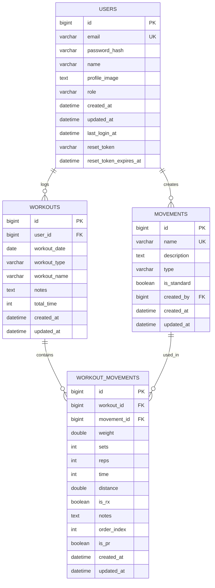

# Current Database Schema (v0.3.0)

This document describes the **currently implemented** database schema in ActaLog as of version 0.2.0-beta (database schema version 0.3.0).

> **Note:** The file `DATABASE_SCHEMA.md` describes a planned future redesign with WODs, user_workouts, and other advanced features. This document describes what is actually running in the database right now.

## Schema Version

**Current Implementation:** 0.3.0 (in production)
**Application Version:** 0.2.0-beta

Applied Migrations:
- 0.1.0: Initial schema with users, workouts, movements, workout_movements
- 0.2.0: Add password reset fields to users table
- 0.3.0: Add PR (Personal Record) tracking to workout_movements

## Current Tables

```
- users
- workouts
- movements
- workout_movements
- schema_migrations
```

## Entity Relationship Diagram



## Table Definitions

### users

Stores user account information and authentication credentials.

| Column | Type | Null | Key | Default | Description |
|--------|------|------|-----|---------|-------------|
| id | BIGINT | NO | PRI | AUTO_INCREMENT | Unique user identifier |
| email | VARCHAR(255) | NO | UNI | - | User email (login identifier) |
| password_hash | VARCHAR(255) | NO | - | - | Bcrypt hashed password |
| name | VARCHAR(255) | NO | - | - | User display name |
| profile_image | TEXT | YES | - | NULL | URL to profile picture |
| role | VARCHAR(50) | NO | MUL | 'user' | User role (user, admin) |
| created_at | DATETIME | NO | - | CURRENT_TIMESTAMP | Account creation time |
| updated_at | DATETIME | NO | - | CURRENT_TIMESTAMP | Last update time |
| last_login_at | DATETIME | YES | - | NULL | Last successful login |
| reset_token | VARCHAR(255) | YES | - | NULL | Password reset token |
| reset_token_expires_at | DATETIME | YES | - | NULL | Reset token expiration |

**Indexes:**
- PRIMARY KEY (id)
- UNIQUE INDEX (email)
- INDEX (role)

**Notes:**
- First user registered automatically becomes admin
- `profile_image` is nullable (stored as pointer in Go struct)
- Password reset tokens expire after configurable duration

---

### workouts

Stores individual workout logs (one per workout session).

| Column | Type | Null | Key | Default | Description |
|--------|------|------|-----|---------|-------------|
| id | BIGINT | NO | PRI | AUTO_INCREMENT | Unique workout identifier |
| user_id | BIGINT | NO | MUL | - | Foreign key to users.id |
| workout_date | DATE | NO | MUL | - | Date workout was performed |
| workout_type | VARCHAR(50) | NO | - | - | Type of workout (e.g., "strength", "wod", "metcon") |
| workout_name | VARCHAR(255) | YES | - | NULL | Optional workout name |
| notes | TEXT | YES | - | NULL | User notes for the workout |
| total_time | INT | YES | - | NULL | Total workout time in seconds |
| created_at | DATETIME | NO | - | CURRENT_TIMESTAMP | Record creation time |
| updated_at | DATETIME | NO | - | CURRENT_TIMESTAMP | Last update time |

**Indexes:**
- PRIMARY KEY (id)
- INDEX (user_id)
- INDEX (workout_date)
- INDEX (user_id, workout_date DESC)

**Foreign Keys:**
- FOREIGN KEY (user_id) REFERENCES users(id) ON DELETE CASCADE

**Notes:**
- Each workout log belongs to a specific user
- `workout_type` is a free-form field (not constrained by enum)
- `total_time` is stored in seconds

---

### movements

Stores movement definitions (exercises like squats, deadlifts, pull-ups).

| Column | Type | Null | Key | Default | Description |
|--------|------|------|-----|---------|-------------|
| id | BIGINT | NO | PRI | AUTO_INCREMENT | Unique movement identifier |
| name | VARCHAR(255) | NO | UNI | - | Movement name (e.g., "Back Squat") |
| description | TEXT | YES | - | NULL | Movement description/instructions |
| type | VARCHAR(50) | NO | MUL | - | Movement category |
| is_standard | TINYINT(1) | NO | MUL | 0 | TRUE if pre-seeded, FALSE if user-created |
| created_by | BIGINT | YES | MUL | NULL | User ID who created (NULL for standard) |
| created_at | DATETIME | NO | - | CURRENT_TIMESTAMP | Record creation time |
| updated_at | DATETIME | NO | - | CURRENT_TIMESTAMP | Last update time |

**Indexes:**
- PRIMARY KEY (id)
- UNIQUE INDEX (name)
- INDEX (type)
- INDEX (is_standard)
- INDEX (created_by)

**Foreign Keys:**
- FOREIGN KEY (created_by) REFERENCES users(id) ON DELETE SET NULL

**Movement Types:**
- `weightlifting` - Barbell movements (squat, deadlift, clean, snatch, etc.)
- `gymnastics` - Bodyweight gymnastics (pull-ups, muscle-ups, handstand push-ups, etc.)
- `bodyweight` - Basic bodyweight exercises (push-ups, sit-ups, burpees, etc.)
- `cardio` - Cardio exercises (rowing, running, biking, etc.)

**Standard Movements (Pre-seeded):**

The application automatically seeds 31 standard movements on first run:

**Weightlifting (15):**
- Back Squat, Front Squat, Overhead Squat
- Deadlift, Sumo Deadlift High Pull
- Clean, Power Clean, Hang Clean
- Snatch, Power Snatch
- Clean and Jerk, Thruster
- Push Press, Push Jerk, Split Jerk

**Gymnastics (7):**
- Pull-up, Chest-to-Bar Pull-up, Muscle-up
- Handstand Push-up, Dip
- Toes-to-Bar, Knees-to-Elbow

**Bodyweight (5):**
- Push-up, Sit-up, Air Squat, Burpee, Box Jump

**Cardio (4):**
- Row, Run, Bike, Ski Erg

---

### workout_movements

Junction table linking workouts to movements with performance details.

| Column | Type | Null | Key | Default | Description |
|--------|------|------|-----|---------|-------------|
| id | BIGINT | NO | PRI | AUTO_INCREMENT | Unique record identifier |
| workout_id | BIGINT | NO | MUL | - | Foreign key to workouts.id |
| movement_id | BIGINT | NO | MUL | - | Foreign key to movements.id |
| weight | DOUBLE | YES | - | NULL | Weight used (lbs or kg) |
| sets | INT | YES | - | NULL | Number of sets |
| reps | INT | YES | - | NULL | Reps per set or total reps |
| time | INT | YES | - | NULL | Time in seconds |
| distance | DOUBLE | YES | - | NULL | Distance (meters or miles) |
| is_rx | TINYINT(1) | NO | - | 0 | TRUE if performed as prescribed |
| notes | TEXT | YES | - | NULL | Movement-specific notes |
| order_index | INT | NO | - | 0 | Order in workout sequence |
| is_pr | TINYINT(1) | NO | - | 0 | TRUE if personal record |
| created_at | DATETIME | NO | - | CURRENT_TIMESTAMP | Record creation time |
| updated_at | DATETIME | NO | - | CURRENT_TIMESTAMP | Last update time |

**Indexes:**
- PRIMARY KEY (id)
- INDEX (workout_id)
- INDEX (movement_id)
- INDEX (workout_id, order_index)

**Foreign Keys:**
- FOREIGN KEY (workout_id) REFERENCES workouts(id) ON DELETE CASCADE
- FOREIGN KEY (movement_id) REFERENCES movements(id) ON DELETE RESTRICT

**Notes:**
- A workout can have multiple movements
- Performance fields (weight, sets, reps, time, distance) are all nullable
- `is_rx` indicates if the workout was done as prescribed (RX) vs scaled
- `is_pr` can be toggled manually or auto-detected by the application
- `order_index` determines the order movements appear in a workout

---

### schema_migrations

Tracks which database migrations have been applied.

| Column | Type | Null | Key | Default | Description |
|--------|------|------|-----|---------|-------------|
| id | INT | NO | PRI | AUTO_INCREMENT | Unique migration record |
| version | VARCHAR(20) | NO | UNI | - | Migration version (e.g., "0.1.0") |
| description | TEXT | YES | - | NULL | Migration description |
| applied_at | DATETIME | NO | - | CURRENT_TIMESTAMP | When migration was applied |

**Indexes:**
- PRIMARY KEY (id)
- UNIQUE INDEX (version)

**Applied Migrations:**
- 0.1.0: Initial schema with users, workouts, movements, workout_movements
- 0.2.0: Add password reset fields to users table
- 0.3.0: Add PR (Personal Record) tracking to workout_movements

---

## Data Model Overview

### Current Implementation (v0.3.0)

The current schema follows a simple model:

**User → Workouts → Workout_Movements ← Movements**

1. Each **User** can log multiple **Workouts**
2. Each **Workout** belongs to one user and can contain multiple movements
3. **Workout_Movements** is a junction table that links workouts to movements
4. **Movements** are shared across all users (standard) or user-specific (custom)

### Key Differences from Planned v0.3.0 (in DATABASE_SCHEMA.md)

The `DATABASE_SCHEMA.md` file describes a **future redesign** that has NOT been implemented yet. Key differences:

| Feature | Current (v0.3.0) | Planned Future |
|---------|------------------|----------------|
| Workouts | User-specific logs | Reusable templates |
| WODs | Not implemented | Separate table with benchmark WODs |
| User Workouts | Integrated in workouts table | Separate junction table |
| PR Tracking | Boolean flag only | Auto-detection with history |
| Movement Types | Single movements table | Separate strength_movements table |
| Audit Logs | Not implemented | Separate audit_logs table |
| User Settings | Not implemented | Separate user_settings table |

---

## Security Considerations

1. **Password Storage**: Passwords hashed using bcrypt with cost factor ≥12
2. **SQL Injection**: All queries use parameterized statements
3. **Cascading Deletes**: User workouts deleted when user is deleted
4. **Data Validation**: Input validation at handler layer before database
5. **Connection Security**: TLS/SSL supported for MySQL/PostgreSQL

---

## Migration History

### v0.1.0 (Initial Schema)
- Created `users`, `workouts`, `movements`, `workout_movements` tables
- Seeded 31 standard movements
- Basic workout logging functionality

### v0.2.0 (Password Reset)
- Added `reset_token` and `reset_token_expires_at` to `users` table
- Enabled password reset flow via email (optional)

### v0.3.0 (PR Tracking)
- Added `is_pr` column to `workout_movements` table
- Enables manual PR flagging
- Foundation for future auto-detection feature

---

## Future Schema Evolution

The planned v0.3.0 redesign (documented in `DATABASE_SCHEMA.md`) will be a major breaking change that includes:
- Separating workout templates from user workout logs
- Adding WOD (Workout of the Day) definitions
- Implementing PR auto-detection
- Adding user settings and audit logs

This will require significant data migration and is planned for a future major version.
